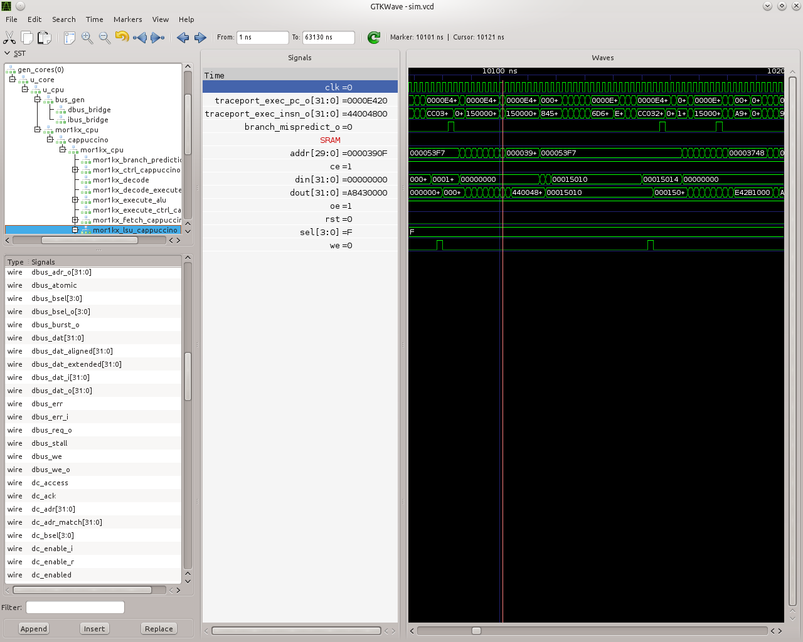

*********
Tutorials
*********

The best way to get started with OpTiMSoC after you've prepared your system as described in the previous chapter is to follow some of our tutorials.
They are written with two goals in mind: to introduce some of the basic concepts and nomenclature of manycore SoC, and to show you how those are implemented and can be used in OpTiMSoC.

Some of the tutorials (especially the first ones) build on top of each other, so it's recommended to do them in order.
Simply stop if you think you know enough to implement your own ideas!

Starting Small: Compute Tile and Embedded Software (Simulated)
==============================================================

It is a good starting point to simulate a single compute tile of a distributed memory system.
Therefore a simple example is included and demonstrates the general simulation approach and gives an insight in the software building process.

Simulating only a single compute tile is essentially an OpenRISC core plus memory and the network adapter, where all I/O of the network adapter is not functional in this test case.
It can therefore only be used to simulate local software.

You can find this example in ``$OPTIMSOC/examples/sim/compute_tile``.

In addition to the simulated SoC hardware, you also need software that runs on the system.
Our demonstration software is available in an extra repository:

.. code:: sh

   git clone https://github.com/optimsoc/baremetal-apps
   cd baremetal-apps

Build a simple "Hello World" example:

.. code:: sh

   cd hello
   make

You will then find the executable elf file as ``hello/hello.elf``.
Furthermore some other files are built.
They are essentially transformed versions of the ELF file, i.e. the software binary.

- ``hello.dis`` is the disassembly of the file
- ``hello.bin`` is the elf representation of the binary file
- ``hello.vmem`` is a textual copy of the binary file

Now you have everything you need to run the hello world example on a simulated SoC hardware:

.. code:: sh
	  
   $OPTIMSOC/examples/sim/compute_tile/compute_tile_sim_singlecore --meminit=hello.vmem

And you'll get roughly this output:

::

   TOP.tb_compute_tile.u_compute_tile.gen_cores[0].u_core.u_cpu.bus_gen.ibus_bridge: Wishbone bus IF is B3_REGISTERED_FEEDBACK
   TOP.tb_compute_tile.u_compute_tile.gen_cores[0].u_core.u_cpu.bus_gen.dbus_bridge: Wishbone bus IF is B3_REGISTERED_FEEDBACK
   [                  22, 0] Software reset
   [               63128, 0] Terminated at address 0x0000e958 (status:          0)
   - ../src/optimsoc_trace_software_0/verilog/software_tracer.sv:104: Verilog $finish

Furthermore, you will find a file called ``stdout.000`` which shows the actual output:

::

   # OpTiMSoC trace_monitor stdout file
   # [TIME, CORE] MESSAGE
   [               39614, 0] Hello World! Core 0 of 1 in tile 0, my absolute core id is: 0
   [               48764, 0] There are 1 compute tiles:
   [               57162, 0]  rank 0 is tile 0

Congratulations, you've ran your first OpTiMSoC system!

.. note:: If you are already familiar with embedded systems or microcontrollers, you might wonder: how did the ``printf()`` output from the software get into the ``stdout.000`` file if there is no UART or anything similar?

   OpTiMSoC software makes excessive use of a useful part of the OpenRISC ISA.
   The "no operation" instruction ``l.nop`` has a parameter ``K`` in assembly.
   This can be used for simulation purposes. It can be used for instrumentation, tracing or special purposes as writing characters with minimal intrusion or simulation termination.

   The termination is forced with ``l.nop 0x1``.
   The instruction is observed and a trace monitor terminates when it was observed at all cores (shortly after ``main()`` returned).

   With this method you can simply provide constants to your simulation environments.
   For variables this method is extended by putting data in further registers (often ``r3``).
   This still is minimally intrusive and allows you to trace values.
   The printf is also done that way (see newlib):

   .. code:: c

      void sim_putc(unsigned char c) {
        asm("l.addi\tr3,%0,0": :"r" (c));
        asm("l.nop %0": :"K" (NOP_PUTC));
      }

   This function is called from printf as write function.
   The trace monitor captures theses characters and puts them to the stdout file.

   You can easily add your own *traces* using a macro defined in ``$OPTIMSOC/soc/sw/include/baremetal/optimsoc-baremetal.h``:

   .. code:: c

      #define OPTIMSOC_TRACE(id,v)                \
         asm("l.addi\tr3,%0,0": :"r" (v) : "r3"); \
         asm("l.nop %0": :"K" (id));

See the Waves
=============

One major benefit of simulating a SoC is the possibility to inspect every signal inside the hardware design quite easily.
When running a Verilator simulation, as we did in the previous step, you can simply add the ``--vcd`` command line option.
It instructs Verilator to write all signals into a file.
You can then start a waveform viewer, like GTKWave to display it.

.. code:: sh
	  
   $OPTIMSOC/examples/sim/compute_tile/compute_tile_sim_singlecore --meminit=hello.vmem --vcd

This command will run the hello world example like it did before, but this time Verilator additionally writes a ``sim.vcd`` waveform file.
You can now view this file.

.. code:: sh

   gtkwave -o sim.vcd

The screenshot is similar to what you should see when running GTKWave.

On the left side you find a hierarchy of all signals in the system.
Add them to the wave view and explore all internals of a working SoC at your fingertips!
Can you find the program counter? The instruction and data caches? The branch predictor?

Going Multicore: Simulate a Multicore Compute Tile
==================================================

Next you might want to build an actual multicore system.
In a first step, you can just start simulations of compute tiles with multiple cores.

Inside ``$OPTIMSOC/examples/sim/compute_tile`` you'll find a dual-core version and a quad-core version of the system with just one compute tile that you just simulated in the previous step.
You can run those examples like you did before.

The first thing you observe: the simulation runs become longer.
After each run, inspect the ``stdout.*`` files.

Welcome to the multicore world!

Tiled Multicore SoC: Simulate a Small 2x2 Distributed Memory System
===================================================================

Next we want to run an actual NoC-based tiled multicore system-on-chip, with the examples you get ``system_2x2_cccc``.
The nomenclature in all pre-packed systems first denotes the dimensions and then the instantiated tiles, here ``cccc`` as four compute tiles.
In our pre-built example, each compute tile has two CPU cores, meaning you have eight CPU cores in total.

Execute it again to get the hello world experience:

.. code:: sh

   $OPTIMSOC/examples/sim/system_2x2_cccc/system_2x2_cccc_sim_dualcore --meminit=hello.vmem

In our simulation all cores in the four tiles run the same software.
Before you shout "that's boring": you can still write different code depending on which tile and core the software is executed.
A couple of functions are useful for that:

- :c:func:`optimsoc_get_numct`: The number of compute tiles in the system
- :c:func:`optimsoc_get_numtiles`: The number of tiles (of any type) in the system
- :c:func:`optimsoc_get_ctrank`: Get the rank of this compute tile in this system.
  Essentially this is just a number that uniquely identifies a compute tile.

There are more useful utility functions like those available, find them in the file ``$OPTIMSOC/soc/sw/include/baremetal/optimsoc-baremetal.h``.

A simple application that uses those functions to do message passing between the different tiles is ``hello_mpsimple``.
This program uses the simple message passing facilities of the network adapter to send messages.
All cores send a message to core 0.
If all messages have been received, core 0 prints a message "Received all messages. Hello World!".

.. code:: sh

   # start from the the baremetal-apps source code directory
   cd hello_mpsimple
   make
   $OPTIMSOC/examples/sim/system_2x2_cccc/system_2x2_cccc_sim_dualcore --meminit=hello_mpsimple.vmem

Have a look what the software does (you find the code in ``hello_mpsimple.c``).
Let's first check the output of core 0.

.. code:: sh

   $> cat stdout.000
   # OpTiMSoC trace_monitor stdout file
   # [TIME, CORE] MESSAGE
   [               42844, 0] Wait for 3 messages
   [               48734, 0] Received all messages. Hello World!

Finally, let's have a quick glance at a more realistic application: ``heat_mpsimple``.
You can find it in the same place as the previous applications, ``hello`` and ``hello_mpsimple``.
The application calculates the heat distribution in a distributed manner.
The cores coordinate their boundary regions by sending messages around.

Can you compile this application and run it?
Don't get nervous, the simulation can take a couple of minutes to finish.
Have a look at the source code and try to understand what's going on.
Also have a look at the ``stdout`` log files.
Core 0 will also print the complete heat distribution at the end.

Observing Software During Execution: The Debug System
=====================================================

Up to now, you have seen the output of the software that runs on your SoC.
And you had a look deep into the inner works of the SoC by looking at the waveforms.

In a real-world system, you need something in between: a way to observe the software as it executes on a chip, but without observing or understanding all the signals inside the hardware.
This is what the debug system provides: hardware inside the chip which allows you to observe what's going on during software execution.

OpTiMSoC also comes with an extensive debug system.
In this section, we'll have a look at this system, how it works and how you can use it to debug your applications.
But before diving into the details, we'll have a short discussion of the basics which are necessary to understand the system.

Many developers know debugging from their daily work.
Most of the time it involves running a program inside a debugger like GDB or Microsoft Visual Studio, setting a breakpoint at the right line of code, and stepping through the program from there on, running one instruction (or one line of code) at a time.
This technique is what we call run-control debugging.
While it works great for single-threaded programs, it cannot easily be applied to debugging parallel software running on possibly heterogeneous many-core SoC.
Instead, the debug support in OpTiMSoC mainly relies on tracing.
Tracing does not stop or otherwise influence the SoC itself; it only "records" what's going on during software execution, and transmits this data to the developer.

The debug system consists of two main parts: the hardware part runs on the OpTiMSoC system itself and collects all data.
The other part runs on a developer's PC (often also called host PC) and controls the debugging process and displays the collected data.

After this introduction, let's make use of the debug system to obtain various traces.
Just like in the previous examples, our SoC hardware is still running in Verilator.
This tutorial works best if you have multiple terminal windows open at the same time, as we'll need to have multiple programs running at the same time.

So, open a new terminal (or a new tab inside your terminal), and start the simulation of the SoC hardware.

.. code:: sh

   $OPTIMSOC/examples/sim/system_2x2_cccc/system_2x2_cccc_sim_dualcore_debug

Now, open a second terminal (leave the first one running!) and type

.. code:: sh

   opensocdebugd tcp

This starts the *Open SoC Debug daemon*.
Open SoC Debug (or short, OSD) is the name of the debug infrastructure that's included with OpTiMSoC.
The Open SoC Debug daemon is a tool which connects to the debug system inside the SoC hardware and interacts with it.
In our case, since the SoC is running inside the Verilator simulation on the same PC, we use TCP to connect the simulated hardware `opensocdebugd`.
Later, if we run the hardware on an FPGA, we'll use UART or USB instead of TCP -- but all the commands stay the same.

After some seconds, `opensocdebugd` will output something like this.

::

   Open SoC Debug Daemon
   Backend: tcp
   System ID: 0001
   22 debug modules found:
    [0]: HOST
      version: 0000
    [1]: SCM
      version: 0000
    [2]: MAM
      version: 0000
      data width: 32, address width: 32
      number of regions: 1
        [0] base address: 0x0000000000000000, memory size: 33554432 Bytes
    [3]: STM
      version: 0000
      xlen: 32
    [4]: CTM
      version: 0000
      addr_width: 32
      data_width: 32
    [5]: STM
      version: 0000
      xlen: 32
    [6]: CTM
      version: 0000
      addr_width: 32
      data_width: 32
    [7]: MAM
      version: 0000
      data width: 32, address width: 32
      number of regions: 1
        [0] base address: 0x0000000000000000, memory size: 33554432 Bytes
    [8]: STM
      version: 0000
      xlen: 32
    [9]: CTM
      version: 0000
      addr_width: 32
      data_width: 32
    [10]: STM
      version: 0000
      xlen: 32
    [11]: CTM
      version: 0000
      addr_width: 32
      data_width: 32
   ... (we've skipped some output here) ...
   Wait for connection

What you see is the output of the *debug system enumeration*.
Internally, the debug system consists of many modules.
When first started, ``opensocdebugd`` first asks the SoC hardware for all available modules and prints them out.
Without going into too much details, the most important ones are the following ones.

- The Memory Access Module (MAM) allows us to write and read memories inside the SoC from the host.
  We'll make use of this in a bit to load our software into the SoC.
- The System Trace Module (STM) is mainly responsible to transmit the output of all ``printf()`` calls to the host PC.
- The Core Trace Module (CTM) observes the software execution on the processor.
  We use it mainly to generate a function trace, i.e. a list of all software functions which have been called.

Why is there not just one of each modules?
We're running a system with four tiles, each with two CPU cores.
There are so many modules, because some of the debug modules are part of a tile, and some are attached to each CPU core.
So this explains why there are four MAM modules, and eight CTM and STM modules each.

Let's go back to our terminals.
Up to now we have two terminals open, let's open a third one.
In here, we start ``osd-cli``, a command line application that allows you to interact with the SoC hardware.

.. code:: sh

   osd-cli

``osd-cli`` supports many commands, and the ``help`` command is probably a good starting point.

.. highlight:: none

::

   osd> help
   Available commands:
     help        Print this help
     <cmd> help  Print help for command
     quit        Exit the command line
     reset       Reset the system
     start       Start the processor cores
     mem         Access memory
     ctm         Configure core trace module
     stm         Configure software trace module
     terminal    Start terminal for device emulation module
     wait        Wait for given seconds
   osd> mem help
   Available subcommands:
     help        Print this help
     test        Run memory tests
     loadelf     Load an elf to memory

Now let's run our hello world software on the SoC.

- First, we reset and then halt all CPUs.
  This gives us a "silent" system, i.e. nothing is running and we can modify the memory without being disturbed by the CPUs.
  ::

     osd> reset -halt

- Next, we load the ELF file of the hello world program into the memory of compute tile 0.
  To do this, we tell the MAM module with ID 2 to write the file into the memory. (See the output of opensocdebugd for all IDs that are available.)
  After writing, the ``-verify`` option instructs ``osd-cli`` to read back all memory content and check if the read data is equal to the written data.
  This step is not strictly necessary, but is helpful to check that the memory write was successful indeed.

  ::
    
     osd> mem loadelf hello.elf 2 -verify
     Verify: 1
     Load program header 0
     Load program header 1
     Verify program header 0
     Verify program header 1

- Before we start the system, we want to observe what's going on when the software is executed.
  We therefore instruct the STM and CTM modules of core 0 to write log files.
  To the CTM we also pass the ELF file, i.e. the program that is executed.
  The CTM can use the information inside this file to record not only the program counter that is executed, but also tell you which function (as written inside the C code) a program counter refers to.
  This makes the CTM logs much nicer to read (at least for humans).

  ::
	  
     osd> stm log stm000.log 3
     osd> ctm log ctm000.log 4 hello.elf

- Finally, we are ready to start the system, i.e. lower the reset signal.

  ::
	  
     osd> start
     osd> [STM 003] 004616b5 Hello World! Core 0 of 2 in tile 0, my absolute core id is: 0
     [STM 003] 0046266e There are 4 compute tiles:
     [STM 003] 00463792  rank 0 is tile 0
     [STM 003] 0046484d  rank 1 is tile 1
     [STM 003] 00465918  rank 2 is tile 2
     [STM 003] 004669ea  rank 3 is tile 3

  Since we have written our hello world program only to core 0, we only get the ``printf()`` output from this core.

- Now that the software has finished, we can close the connection by typing

  ::

     osd> quit

Remember that we instructed the STM and CTM modules to write log files?
Have a look at the files ``stm000.log`` and ``ctm000.log`` to find all STM and CTM messages that were issued by the system.
If possible the modules already assemble them back together to be more useful to the human user.
For example, the STM creates the ``printf()`` output out of the trace messages (and you see both inside the file).
The CTM uses the passed ELF file to resolve the function names that you see in the log file.

Automating System Interaction
=============================

In the previous section, you have manually typed commands into ``osd-cli`` to interact with the debug system.
We understand that this is something you don't want to do all day.
To make things easier, our debug components come with a Python interface that you can use to automate all the steps.
To make it even more easy, you can use an example script that does exactly what you just typed manually: load all memories of a system and start the CPUs.
The script then waits for ten seconds before it closes the connection to the ``opensocdebugd``.
(If your application runs longer than that adjust the script accordingly.)

.. code:: sh

   # only Python 2 is supported at the moment
   python2 $OPTIMSOC/host/share/opensocdebug/examples/runelf.py hello.elf

This ends our experiments with SoCs running as Verilator simulation.
In the next sections, we'll move to an FPGA board and see how we can run software on that.

Our SoC on an FPGA
==================

Welcome to the fun of real hardware!
Before we can get started, you need to clarify some prerequisites.

Prerequisites: FPGA board and Vivado
------------------------------------

This, of course, first means that you need borrow, buy or otherwise obtain an FPGA board.
In this tutorial, we use the Nexys 4 DDR board by Xilinx/Digilent.
It's not that expensive (of course, depending on your financial situation) and widely available.
If you need help obtaining one, let us know - maybe we can help out in some way.

Additionally you need to download and install the Xilinx Vivado tool (the cost-free WebPack license is sufficient).
We used the 2016.2 version when preparing this tutorial; we strongly recommend you also use this exact version.

Once you have obtained the FPGA board, connect it to the PC on the "PROG UART" USB connection.
You don't need to connect any additional power supply.

Programming the FPGA
--------------------

With the board connected, we can program (or "flash") the FPGA with our hardware design, the *bitstream*.
The OpTiMSoC release contains pre-built bitstreams for the single compute tile system and a 2x2 system with four compute tiles, meaning we can start directly with programming the FPGA.

There are two ways to program the device: using the Vivado GUI, or using the command line.

Programming the FPGA with the Vivado GUI
^^^^^^^^^^^^^^^^^^^^^^^^^^^^^^^^^^^^^^^^

- Open Vivado (e.g. by typing ``vivado`` into a terminal window)
- On the welcome screen, click on "Hardware Manager"
- Ensure that your Nexys4 DDR board is plugged into your PC and is turned on.
- Click on "Open Target" in the green bar on the top, and then on "Auto Connect"
- Now click on "Program Device" in the same green bar and select the only option ``xc7a100t\_0`` (that's the FPGA on the board).
- In the dialog window, select the bitstream file. We'll start directly with the larger 2x2 system, you can find the bitstream in
   ``$OPTISMOC/examples/fpga/nexys4ddr/system_2x2_cccc/system_2x2_cccc_nexys4ddr.bit``.
- You can leave the other field "Debug probes file" empty.
- Click on "Program" to download the bitstream onto the FPGA.

After a couple of seconds, your FPGA contains the SoC hardware and is ready to be used.

Programming the FPGA on the Command Line
^^^^^^^^^^^^^^^^^^^^^^^^^^^^^^^^^^^^^^^^

.. code:: sh

   optimsoc-pgm-fpga $OPTIMSOC/examples/fpga/nexys4ddr/system_2x2_cccc/system_2x2_cccc_nexys4ddr.bit xc7a100t_0

Connecting
----------

In the previous tutorials, we have already seen the debug infrastructure and connected to it over TCP.
We now use the same tools to connect to our SoC, but this time we connect to the FPGA using UART.
Fortunately, you don't need to connect any additional cables; the USB cable that you just used to program the FPGA is also the serial connection.

First, check which serial port was assigned to the board.
Usually the easiest way is to do a

.. code:: sh

   ls /dev/ttyUSB*

If you have only the Nexys 4 DDR board connected, you'll see only one device, e.g. ``/dev/ttyUSB0``.
Make note of this device name, and replace it accordingly in all the following steps in this tutorial.

Just as before, we'll need more than one terminal window.
Open a first terminal and start ``opensocdebugd`` (remember to replace the device with your device name).

.. code:: sh

   opensocdebugd uart device=/dev/ttyUSB1 speed=12000000

The output you see should be almost identical to what you've seen in Section~\ref{sec:tutorials:debug_system_intro}, with one change:
the system you're now using has just one CPU per compute tile, so only four cores in total.
As consequence, you see less CTM and STM modules.

Running Software
----------------

Now that you've connected to the system, can you run software on it?
Yes, you already know how!
Open a new terminal window, and use ``osd-cli`` or the Python script to flash the memories with an ELF file and run the system.

When you run software, you'll notice two things: first, the output is the same as you've already seen when running the system in simulation.
But: it's much faster. The FPGA runs at 50~MHz, which is still quite slow compared to current desktop processors, but still much faster than the simulation.

This concludes our tutorial session, and hands over to you:
modify the software as you wish, program it again, analyze the simulations and explore your first multicore SoC.

Make Message Passing More Simple
================================

So far you have used the low level message passing buffers to exchange data between the tiles.
You may remember that exchanging this data involved forming and parsing messages including the low level network-on-chip details.

To abstract from these low level details and to encapsulate certain extensions OpTiMSoC comes with the message passing library (``libmp``).
It is a rather simple, straight-forward message passing API.
Two different styles of communication are supported: message-oriented and connection-oriented.
Message-oriented communication is prefered when you have spurious communication between many different communication partners.
Connection-oriented communication is prefered when you have a fixed setup of channels between communication partners.

In this part of the tutorial you will learn the basic usage of the message passing library using message-oriented communication.
In the ``baremetal-apps`` you can find the ``hello_mp`` example.
Inspecting ``hello_mp.c`` you can see that it is much less code than the low level example from before.

Lets have a look at how it works. It starts with initializing the hardware and software:

.. code:: c

   optimsoc_init(0);
   optimsoc_mp_initialize(0);

The parameters of those functions can be ignored for now.
After calling those functions you can use the message passing library.

Communication in the message passing library takes place between so called endpoints.
In the next step we create an endpoint in each tile:

.. code:: c

   optimsoc_mp_endpoint_handle ep;
   optimsoc_mp_endpoint_create(&ep, 0, 0, OPTIMSOC_MP_EP_CONNECTIONLESS, 2, 0);

:c:type:`optimsoc_mp_endpoint_handle` is the opaque type used to identify an endpoint in your code.
You create and initialize the endpoint by calling :c:func:`optimsoc_mp_endpoint_create` that takes a reference to this handle as first parameter.
The second and third parameter initialize the endpoint with a node and port.
Each endpoint is globally addressable with its ``(tile, node, port)`` identifier.
In our case the node 0 and port 0 endpoint is created in each tile.

The remaining parameters of :c:func:`optimsoc_mp_endpoint_create` configure the endpoint.
By using :c:type:`OPTIMSOC_MP_EP_CONNECTIONLESS` we create it to receive messages from arbitrary tiles.
The last two parameters configure the number of messages it can hold and the maximum message size (``0`` says it is the default).

Now the code of the example diverts again, all but tile 0 execute:

.. code:: c

   optimsoc_mp_endpoint_handle ep_remote;
   optimsoc_mp_endpoint_get(&ep_remote, 0, 0, 0);

   optimsoc_mp_msg_send(ep, ep_remote, (uint8_t*) &rank, sizeof(rank));

So what they do is to define a second endpoint.
But in this case it is not locally generated but points to a remote endpoint.
It is the one we want to send a message too: tile 0, node 0, port 0.
What happens under the hood it blocks until the remote endpoint is created and ready and than stores some information locally.
In the final step the software sends a word to the remote endpoint using the local endpoint for sending.

In tile zero the software waits to receive all messages using:

.. code:: c

   optimsoc_mp_msg_recv(ep, (uint8_t*) &remote, 4, &received);

You can now run the example using:

.. code:: sh

   # start from the the baremetal-apps source code directory
   cd hello_mp
   make
   $OPTIMSOC/examples/sim/system_2x2_cccc/system_2x2_cccc_sim --meminit=hello_mp.vmem

::

   TOP.tb_system_2x2_cccc.u_system.gen_ct[0].u_ct.gen_cores[0].u_core.u_cpu.bus_gen.ibus_bridge: Wishbone bus IF is B3_REGISTERED_FEEDBACK
   TOP.tb_system_2x2_cccc.u_system.gen_ct[0].u_ct.gen_cores[0].u_core.u_cpu.bus_gen.dbus_bridge: Wishbone bus IF is B3_REGISTERED_FEEDBACK
   TOP.tb_system_2x2_cccc.u_system.gen_ct[1].u_ct.gen_cores[0].u_core.u_cpu.bus_gen.ibus_bridge: Wishbone bus IF is B3_REGISTERED_FEEDBACK
   TOP.tb_system_2x2_cccc.u_system.gen_ct[1].u_ct.gen_cores[0].u_core.u_cpu.bus_gen.dbus_bridge: Wishbone bus IF is B3_REGISTERED_FEEDBACK
   TOP.tb_system_2x2_cccc.u_system.gen_ct[2].u_ct.gen_cores[0].u_core.u_cpu.bus_gen.ibus_bridge: Wishbone bus IF is B3_REGISTERED_FEEDBACK
   TOP.tb_system_2x2_cccc.u_system.gen_ct[2].u_ct.gen_cores[0].u_core.u_cpu.bus_gen.dbus_bridge: Wishbone bus IF is B3_REGISTERED_FEEDBACK
   TOP.tb_system_2x2_cccc.u_system.gen_ct[3].u_ct.gen_cores[0].u_core.u_cpu.bus_gen.ibus_bridge: Wishbone bus IF is B3_REGISTERED_FEEDBACK
   TOP.tb_system_2x2_cccc.u_system.gen_ct[3].u_ct.gen_cores[0].u_core.u_cpu.bus_gen.dbus_bridge: Wishbone bus IF is B3_REGISTERED_FEEDBACK
   [               50602, 1] Terminated at address 0x00011364 (status:          0)
   [               65212, 2] Terminated at address 0x00011364 (status:          0)
   [              169848, 3] Terminated at address 0x00011364 (status:          0)
   [              180834, 0] Terminated at address 0x00011364 (status:          0)

You can see that the cores in the tiles have terminated over a longer time frame.
Core 0 exits as last after printing to the output in ``stdout.000``:

::

   # OpTiMSoC trace_monitor stdout file
   # [TIME, CORE] MESSAGE
   [               72050, 0] Received from 1
   [               78792, 0] Received from 2
   [              179834, 0] Received from 3

