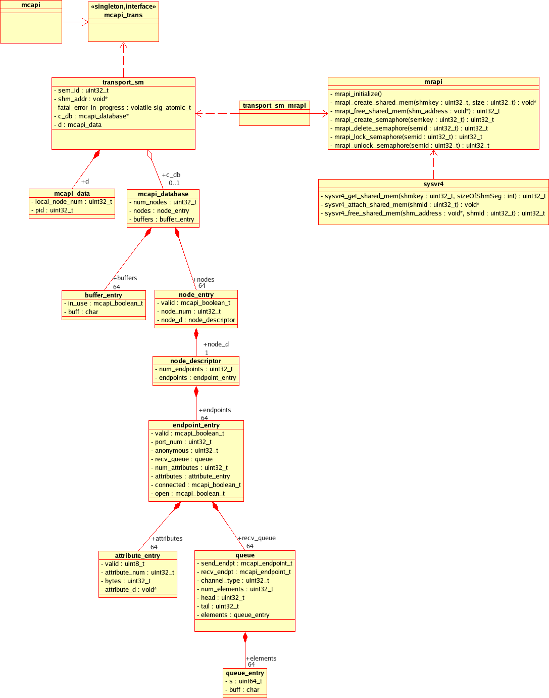

.. include:: fsl-header.rst

=============================
MCAPI Design Document
=============================

This document describes the high-level design of the MCAPI implementation.

:Author:
  Michele Reese
:Contact:
  michele.reese@freescale.com

.. contents:: Table of Contents
   :backlinks: entry

.. sectnum::

Overview
========

This is the design for the first implementation of the MCAPI spec.

Library Usage
=============

This project builds the MCAPI library and uses the MRAPI library.

Design
================

The primary design goals are portability and size.  Thus the implementation is
done using ansi C and the use of external libraries is limited.  Even though the
implementation is done in C, we have attempted to capture the design as an
object-oriented design using UML.

UML Model
==========

The database model code is declared in ``transport_sm.h``.

   Class Diagram For MCAPI Model that uses MRAPI for resource handling.

Error Handling
==============

Error handling is done at the MCAPI layer.  All methods that this layer calls
return a boolean usually indicating success or failure.  It's up to MCAPI to do
all error checking prior to calling the transport layer and fill in the status
appropriately.  In addition, asserts are used heavily.  These can be turned off
for releases.

